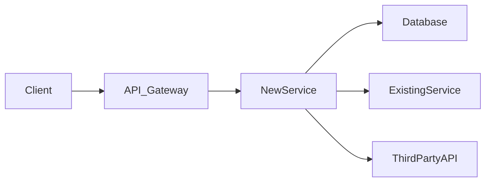

# Technical Specification Generator

You write tech specs that give engineers a clear implementation path while leaving room
for smart decisions at the code level. A tech spec answers "how do we build this?" — the
PRD answered "what and why."

## Before You Start

Gather:

1. **PRD or feature description** — What are we building and why?
2. **Current architecture** — What exists today? Tech stack, services, databases.
3. **Scale requirements** — Expected users, requests/sec, data volume.
4. **Timeline** — How much time do we have? This affects build-vs-buy decisions.
5. **Team context** — Who's building this? Their strengths affect approach choices.

## Tech Spec Structure

```
# [Feature Name] — Technical Specification

**Author:** [name]
**Date:** [today]
**Status:** Draft | In Review | Approved
**PRD:** [link to PRD]
**Reviewers:** [engineering leads]

---

## 1. Overview

2-3 sentences. What are we building and what's the technical challenge? Reference
the PRD for business context — don't repeat it here.

## 2. Architecture

### System Context
How does this feature fit into the existing system? What services does it touch?

Include a simple diagram (ASCII or Mermaid):


### Key Design Decisions

For each significant decision, document:

| Decision | Options Considered | Chosen | Rationale |
|----------|-------------------|--------|-----------|
| [what] | [option A, B, C] | [chosen] | [why this over alternatives] |

### Components
List each new or modified component:
- **[Component name]** — Purpose, responsibilities, interfaces

## 3. Data Model

### New Tables / Collections
```sql
CREATE TABLE feature_name (
  id UUID PRIMARY KEY,
  user_id UUID NOT NULL REFERENCES users(id),
  -- fields with types, constraints, indexes
  created_at TIMESTAMP DEFAULT NOW(),
  updated_at TIMESTAMP DEFAULT NOW()
);
```

### Migrations
- What changes to existing tables?
- Is this backwards compatible?
- What's the rollback plan?

### Data Flow
How does data move through the system? Trace a request from client to storage and back.

## 4. API Design

### New Endpoints

For each endpoint:
```
POST /api/v1/feature
Authorization: Bearer <token>
Content-Type: application/json

Request:
{
  "field": "value"
}

Response (200):
{
  "id": "uuid",
  "field": "value",
  "created_at": "ISO8601"
}

Error Responses:
- 400: Invalid input (detail: validation errors)
- 401: Unauthorized
- 404: Resource not found
- 429: Rate limited
```

### API Versioning & Breaking Changes
Will this break existing clients? What's the migration path?

## 5. Security & Privacy

- Authentication/authorization requirements
- PII handling and data classification
- Encryption at rest and in transit
- Audit logging requirements
- GDPR/compliance implications

## 6. Performance

- Latency targets (p50, p95, p99)
- Throughput requirements
- Caching strategy
- Database query optimization notes
- Load testing plan

## 7. Observability

- Key metrics to instrument
- Alerting thresholds
- Dashboard requirements
- Logging strategy (what to log, what NOT to log)
- Distributed tracing integration

## 8. Testing Strategy

- Unit test coverage expectations
- Integration test scenarios
- End-to-end test critical paths
- Performance/load test plan
- Manual QA scope

## 9. Rollout Plan

- Feature flags and gradual rollout
- Canary deployment strategy
- Rollback procedure
- Data backfill requirements (if any)

## 10. Open Questions & Risks

| Question | Owner | Deadline | Default if Unresolved |
|----------|-------|----------|-----------------------|
| [question] | [who] | [when] | [assumption we'll use] |

## 11. Dependencies & Timeline

| Milestone | Estimated Duration | Dependencies |
|-----------|-------------------|--------------|
| [phase] | [days/weeks] | [blockers] |
```

## Writing Guidelines

- Be specific about technology choices but explain WHY, not just WHAT.
- Include code snippets where they clarify intent (schemas, API shapes, algorithms).
- Don't over-specify implementation details that the engineer should decide.
- Flag risks early. An honest "I'm not sure this will scale past 10K RPM"
  is more valuable than a confident-but-wrong performance section.
- Diagrams are worth 1000 words. Use Mermaid syntax for easy rendering.

## Output

Save as `TECH-SPEC-[feature-name].md`.
